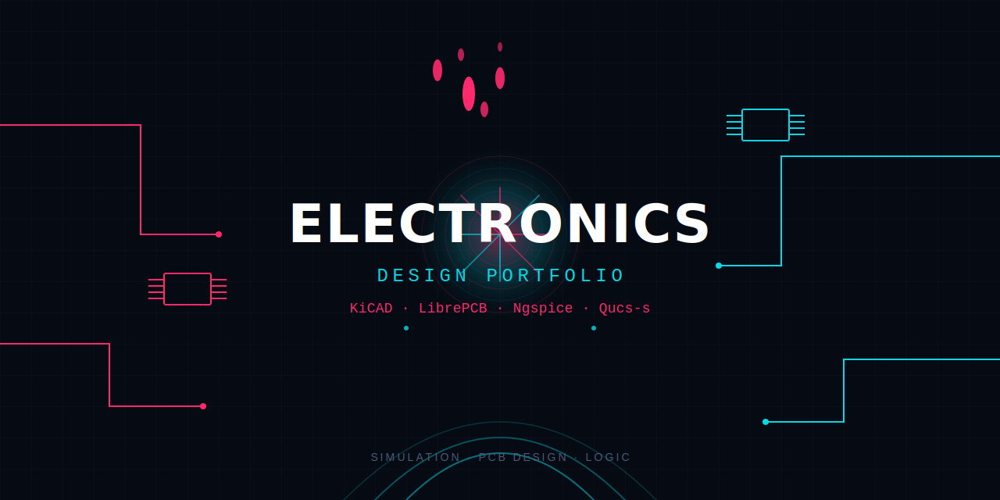

<p align="center">
  
</p>

<h1 align="center">Electronics Design Portfolio</h1>

<p align="center">
  <em>Water meets circuit — a living collection of EDA projects, simulations, and hardware designs.</em>
</p>

<p align="center">
  
  
  
  
  
</p>

---

## About

This repository showcases my work in **Electronic Design Automation (EDA)** — from schematic capture and PCB layout to SPICE-level simulation and digital logic verification. It is built to pair with the *Electronics Design & Simulation (EDA) Specialists* initiative and serves as a public, version-controlled portfolio.

**Core domains:** Simulation · PCB Design · Logic

## Tools & Stack

| Domain | Primary Tools |
|--------|---------------|
| **Schematic & PCB** | KiCAD, LibrePCB |
| **Analog / Mixed-Signal Simulation** | Ngspice, Qucs-s |
| **Analysis Types** | AC, DC, Transient, S-Parameters, Digital Timing |
| **Fabrication Outputs** | Gerber RS-274X, Excellon Drill, Interactive BOM |

## Featured Projects

> *Add your projects here as you build them. Each project should live in its own directory under `/projects` with a README, schematic exports, and simulation results.*

| Project | Description | Tools | Status |
|---------|-------------|-------|--------|
| `projects/placeholder-1` | *(Coming soon)* High-speed differential pair practice board | KiCAD | 🚧 In Progress |
| `projects/placeholder-2` | *(Coming soon)* Low-noise audio pre-amplifier simulation | Ngspice | 📋 Planned |

## Repository Structure

```text
electronics-design-portfolio/
├── assets/                  # Banner, images, and documentation media
├── projects/                # Individual hardware / simulation projects
│   ├── template/            # Copy this folder to start a new project
│   │   ├── schematic/
│   │   ├── pcb/
│   │   ├── simulation/
│   │   └── README.md
│   └── README.md            # Index of all projects
├── docs/                    # Deep-dive articles and theory notes
├── README.md                # You are here
└── LICENSE
